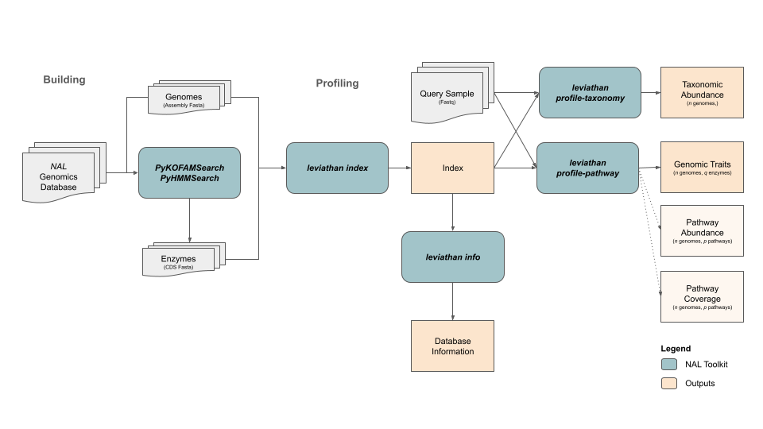

# Leviathan
`Leviathan` is a fast, memory-efficient, and scalable taxonomic and pathway profiler for next generation sequencing (genome-resolved) metagenomics and metatranscriptomics.  `Leviathan` is powered by `Salmon` and `Sylph` in the backend.

## Benchmarking
Benchmarking using trimmed SRR12042303 sample with 4 threads on ram16GB-cpu4 SageMaker instance (ml.m5.4xlarge)

| number_of_genomes | number_of_cds_with_features | preprocess | index | profile-taxonomy | profile-pathway |
|-------------------|-----------------------------|------------|-------|------------------|-----------------|
| 10                | 1928                        | 0:03       | 0:09  | 0:41             | 2:09            |
| 100               | 18410                       | 0:31       | 0:26  | 0:41             | 4:29            |
| 1000              | 191155                      | 5:29       | 3:55  | 0:43             | 12:50           |
| 10000             | 1684876                     | 46:00      | 39:10 | 0:48             | 18:14           |


## Modules
### `leviathan preprocess` - Preprocesses data into form than can be used by `leviathan index` 
    
    ```
    leviathan-preprocess.py \
        -i references/manifest.tsv \
        -a references/pykofamsearch.pathways.tsv.gz \
        -o references/
    ```
    

### `leviathan index` - Build, update, and validate `leviathan` database
    ```
    leviathan-index.py \
        -f references/cds.fasta.gz \
        -m references/feature_mapping.tsv.gz \
        -g references/genomes.tsv.gz \
        -d references/index/ \
        -p=-1
    ```
### `leviathan info` - Report information about `leviathan` database
    ```
    leviathan-info.py -d references/index/
    ```
### `leviathan profile-taxonomy` - Profile taxonomy using `Sylph` with `leviathan` database
    ```
    leviathan-profile-taxonomy.py \
        -1 ../Fastq/SRR12042303_1.fastq.gz \
        -2 ../Fastq/SRR12042303_2.fastq.gz \
        -n SRR12042303 \
        -d references/index/ \
        -o leviathan_output/profiling/taxonomy/ \
        -p=-1
    ```
### `leviathan profile-pathway` - Profile pathways using `Salmon` with `leviathan` database
    ```
    leviathan-profile-pathway.py \
        -1 ../Fastq/SRR12042303_1.fastq.gz \
        -2 ../Fastq/SRR12042303_2.fastq.gz \
        -n SRR12042303 \
        -d references/index/ \
        -o leviathan_output/profiling/pathway/ \
        -p=-1
    ```

### `leviathan merge` - Merge sample-specific taxonomic and/or pathway profiling
    ```
    leviathan-merge.py \
        -t leviathan_output/profiling/taxonomy/ \
        -p leviathan_output/profiling/pathway/ \
    ```

## Utility Scripts
* `compile-manifest-from-veba.py` - Compiles manifest.tsv file for `leviathan preprocess` from `VEBA` binning output 

    ```
    compile-manifest-from-veba.py \
        -i path/to/veba_output/binning/ \
        -t prokaryotic,eukaryotic \
        -o references/manifest.tsv
    ```

## Output Description

### Sample Specific
#### Taxonomy profiles
* Examples: 
    - Genome = Metagenome-assembled genome (MAG)
    - Genome cluster = ANI ≥ 95% & Alignment Fraction ≥ 50%

##### Taxonomic abundances - Relative abundance of a genome/genome-cluster within a sample
 * `taxonomic_abundance.genome_clusters.[parquet|tsv.gz]` - Genome-cluster-level taxonomic relative abundance profiles
 * `taxonomic_abundance.genomes.[parquet|tsv.gz]` - Genome-level taxonomic relative abundance profiles

**Note:** `Sylph` is run with `--estimate-unknown` so relative abundances do not sum to 100% and the remaining % represents the unassigned reads.

#### Functional profiles

* Examples:
    - Feature = KEGG ortholog
    - Pathway = KEGG module

##### Feature abundances - The (normalized) abundance of a feature relative to a genome/genome-cluster
 * `feature_abundances.genome_clusters.number_of_reads.[parquet|tsv.gz]` - Feature abundances for each genome cluster (number of reads aligned)
 * `feature_abundances.genome_clusters.tpm.[parquet|tsv.gz]` - Feature abundances for each genome cluster (TPM normalized abundances)
 * `feature_abundances.genomes.number_of_reads.[parquet|tsv.gz]` - Feature abundances for each genome (number of reads aligned)
 * `feature_abundances.genomes.tpm.[parquet|tsv.gz]` - Feature abundances for each genome (TPM normalized abundances)

##### Feature prevalence - The number of genome/genome-clusters where a feature is detected
 * `feature_prevalence-binary.genome_clusters.[parquet|tsv.gz]` - Binary feature prevalence relative to genome clusters
 * `feature_prevalence-binary.genomes.[parquet|tsv.gz]` - Binary feature prevalence relative to genomes
 * `feature_prevalence-ratio.genome_clusters.[parquet|tsv.gz]` - Ratio of genomes within a genome cluster with feature detected
 * `feature_prevalence.genome_clusters.[parquet|tsv.gz]` - Binary feature prevalence relative to genome clusters
 * `feature_prevalence.genomes.[parquet|tsv.gz]` - Feature prevalence relative to genomes

##### Gene abundances - The abundance of individual genes within genome
 * `gene_abundances.genomes.number_of_reads.[parquet|tsv.gz]` - Number of reads aligned to a gene within a genome
 * `gene_abundances.genomes.tpm.[parquet|tsv.gz]` - TPM normalized abundance of reads aligned to a gene within a genome

##### Pathway abundances - Pathway abundances for a genome and genome-cluster

 * `pathway_abundances.genome_clusters.coverage.[parquet|tsv.gz]` - Pathway coverage relative to genome clusters
 * `pathway_abundances.genome_clusters.number_of_reads.[parquet|tsv.gz]` - Pathway abundances as the number of reads aligned relative to genome clusters
 * `pathway_abundances.genome_clusters.tpm.[parquet|tsv.gz]` - TPM normalized pathway abundances as the number of reads aligned relative to genome clusters
 * `pathway_abundances.genomes.coverage.[parquet|tsv.gz]` - Pathway coverage relative to genomes
 * `pathway_abundances.genomes.number_of_reads.[parquet|tsv.gz]` - Pathway abundances as the number of reads aligned relative to genomes
 * `pathway_abundances.genomes.tpm.[parquet|tsv.gz]` - TPM normalized pathway abundances as the number of reads aligned relative to genomes

### Merged

##### Taxonomy profiles
Sequence abundances can be used to determine the proportion of reads that were detected in database.

 * `taxonomic_abundance.genome_clusters.nc` - Genome-level taxonomic and sequence relative abundance profiles for all samples
 * `taxonomic_abundance.genomes.nc` - Genome-level taxonomic and sequence relative abundance profiles for all samples.

#### Functional profiles
##### Feature
 * `feature.genome_clusters.nc` - Feature abundances (number of reads, tpm) and prevalences (binary, total, ratio) of genome clusters for all samples
 * `feature.genomes.nc` - Feature abundances (number of reads, tpm) and prevalences (binary, total, ratio) of genomes for all samples

##### Pathway
 * `pathway.genome_clusters.nc` - Pathway abundances (number of reads, tpm) and coverages of genome clusters for all samples
 * `pathway.genomes.nc` - Pathway abundances (number of reads, tpm) and coverages of genomes for all samples

## Reading NetCDF files with Xarray

```python
import xarray as xr

# Taxonomic abundances for genomes
ds_taxonomic = xr.open_dataset("leviathan_output/artifacts/taxonomic_abundances.genomes.nc")
ds_taxonomic

<xarray.Dataset> Size: 3kB
Dimensions:               (samples: 4, genomes: 23)
Coordinates:
  * samples               (samples) <U2 32B 'S3' 'S4' 'S1' 'S2'
  * genomes               (genomes) <U26 2kB 'S1__BINETTE__P.1__bin_210' ... ...
Data variables:
    taxonomic_abundances  (samples, genomes) float32 368B ...
    sequence_abundances   (samples, genomes) float32 368B ...

# Pathway abundances and coverage for genome clusters
ds_pathway = xr.open_dataset("leviathan_output/artifacts/pathway.genome_clusters.nc")
ds_pathway
<xarray.Dataset> Size: 276kB
Dimensions:          (genome_clusters: 19, pathways: 292, samples: 4)
Coordinates:
  * genome_clusters  (genome_clusters) <U37 3kB 'ESLC-a2a3ed2541a4e0cbd4acd3a...
  * pathways         (pathways) <U6 7kB 'M00001' 'M00002' ... 'M00982' 'M00983'
  * samples          (samples) <U2 32B 'S3' 'S4' 'S1' 'S2'
Data variables:
    number_of_reads  (samples, genome_clusters, pathways) float32 89kB ...
    tpm              (samples, genome_clusters, pathways) float32 89kB ...
    coverage         (samples, genome_clusters, pathways) float32 89kB ...

```

## Pathway Databases
Currently, the only pathway database supported for pathway coverage calculations is the KEGG module database using KEGG orthologs as features.  This database can be pre-built using [KEGG Pathway Profiler](https://github.com/jolespin/kegg_pathway_profiler) or built with `leviathan index` if KEGG orthologs are used as features.  

To maintain generalizability for custom feature sets (e.g., enzymes, reactions), the pathway database is not required but if it is not used when building `leviathan index` then the `leviathan profile-pathway` skips the pathway abundance and coverage calculations.

If custom databases are built, then the following nested Python dictionary structure needs to be followed: 

```python
# General Example
{
    id_pathway:{
        "name":Name of pathway,
        "definition":KEGG module definition,
        "classes":KEGG module classes,
        "graph":NetworkX MultiDiGraph,
        "ko_to_nodes": Dictionary of KEGG ortholog to nodes in graph,
        "optional_kos": Set of optional KEGG orthologs
    },
    }

# Specific Example
{
    'M00001': {
        'name': 'Glycolysis (Embden-Meyerhof pathway), glucose => pyruvate',
        'definition': (
            '(K00844,K12407,K00845,K25026,K00886,K08074,K00918) '
            '(K01810,K06859,K13810,K15916) '
            '(K00850,K16370,K21071,K00918) '
            '(K01623,K01624,K11645,K16305,K16306) '
            'K01803 ((K00134,K00150) K00927,K11389) '
            '(K01834,K15633,K15634,K15635) '
            '(K01689,K27394) '
            '(K00873,K12406)'
        ),
        'classes': 'Pathway modules; Carbohydrate metabolism; Central carbohydrate metabolism',
        'graph': <networkx.classes.multidigraph.MultiDiGraph object at 0x132d2a9e0>,
        'ko_to_nodes': {
            'K00844': [[0, 2]],
            'K12407': [[0, 2]],
            'K00845': [[0, 2]],
            'K25026': [[0, 2]],
            'K00886': [[0, 2]],
            'K08074': [[0, 2]],
            'K00918': [[0, 2], [3, 4]],
            'K01810': [[2, 3]],
            'K06859': [[2, 3]],
            'K13810': [[2, 3]],
            'K15916': [[2, 3]],
            'K00850': [[3, 4]],
            'K16370': [[3, 4]],
            'K21071': [[3, 4]],
            'K01623': [[4, 5]],
            'K01624': [[4, 5]],
            'K11645': [[4, 5]],
            'K16305': [[4, 5]],
            'K16306': [[4, 5]],
            'K01803': [[5, 6]],
            'K00134': [[6, 8]],
            'K00150': [[6, 8]],
            'K00927': [[8, 7]],
            'K11389': [[6, 7]],
            'K01834': [[7, 9]],
            'K15633': [[7, 9]],
            'K15634': [[7, 9]],
            'K15635': [[7, 9]],
            'K01689': [[9, 10]],
            'K27394': [[9, 10]],
            'K00873': [[10, 1]],
            'K12406': [[10, 1]]
        },
        'optional_kos': set()
    },
    'M00002': {
        'name': 'Glycolysis, core module involving three-carbon compounds',
        'definition': (
            'K01803 ((K00134,K00150) K00927,K11389) '
            '(K01834,K15633,K15634,K15635) '
            '(K01689,K27394) '
            '(K00873,K12406)'
        ),
        'classes': 'Pathway modules; Carbohydrate metabolism; Central carbohydrate metabolism',
        'graph': <networkx.classes.multidigraph.MultiDiGraph object at 0x10d51b160>,
        'ko_to_nodes': {
            'K01803': [[0, 2]],
            'K00134': [[2, 4]],
            'K00150': [[2, 4]],
            'K00927': [[4, 3]],
            'K11389': [[2, 3]],
            'K01834': [[3, 5]],
            'K15633': [[3, 5]],
            'K15634': [[3, 5]],
            'K15635': [[3, 5]],
            'K01689': [[5, 6]],
            'K27394': [[5, 6]],
            'K00873': [[6, 1]],
            'K12406': [[6, 1]]
        },
        'optional_kos': set()
    },
    ...
}

```
For documentation for pathway theory or how `MultiDiGraph` objects are generated, please refer to the source repository for [KEGG Pathway Completeness Tool](https://github.com/EBI-Metagenomics/kegg-pathways-completeness-tool) as [KEGG Pathway Profiler](https://github.com/jolespin/kegg_pathway_profiler) is a reimplementation for production.

## Development Stage:
* `beta`

## Citation:
* In progress

## Contact:
* jol.espinoz@gmail.com

## Modules:


## Documentation:


