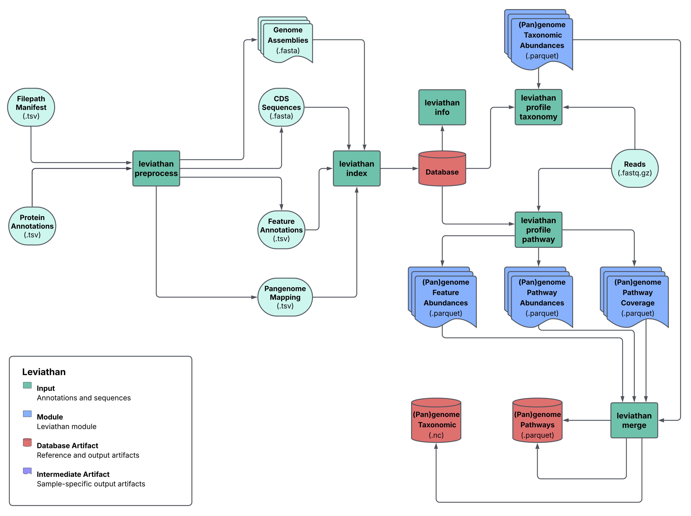

# Leviathan
### A fast, memory-efficient, and scalable taxonomic and pathway profiler for (pan)genome-resolved metagenomics and metatranscriptomics 

`Leviathan` is for performing taxonomic or functional profiling on genome-resolved catalogs.  This toolkit was designed for targeted genomic catalogs but supports general catalogs.  However, only highly similar organisms will be detected as this tool (currently) does not support remote homology.

> [!NOTE]
> `Leviathan` is powered by [`Salmon`](https://doi.org/10.1038/nmeth.4197) and [`Sylph`](https://doi.org/10.1038/s41587-024-02412-y) Rust backends.



## Usage
### Install

```
# Create environment with dependencies
mamba create -n leviathan -c conda-forge -c bioconda python salmon sylph samtools -y

# Activate environment
mamba activate leviathan

# Install Leviathan
pip install leviathan 
```


### Quick Start
After [fetching databases (and annotating proteins)](docs/FETCH-ANNOTATE.md) you can [build a Leviathan database](docs/END-TO-END.md).  Once a database is built, you can easily profile each sample in parallel and merge the results into optimized data structures. 

#### Profile taxonomy (per sample)
```
leviathan-profile-taxonomy.py -1 <r1-fastq[.gz]> -2 <r2-fastq[.gz]> -n <sample-name> -d <leviathan-database> -o <output-directory>/taxonomy/ -p=-1
```
#### Profile pathways (per sample)
```
leviathan-profile-pathway.py -1 <r1-fastq[.gz]> -2 <r2-fastq[.gz]> -n <sample-name> -d <leviathan-database> -o <output-directory>/taxonomy/ -p=-1
```
#### Merge artifacts from individual samples
```
leviathan-merge.py -t <output-directory>/taxonomy/ -p <output-directory>/pathway/
```
### Walkthroughs
* [Fetching and Annotating](docs/FETCH-ANNOTATE.md) - Fetching backend databases and annotating proteins
* [End-to-End](docs/END-TO-END.md) - Detailed walkthrough on how to run each module including downloading test data and interpreting output files. 

## Documentation
* [Modules](docs/MODULES.md) - Description of modules and basic usage
* [Outputs](docs/OUTPUTS.md) - Description of output tables and objects
* [Pahthways](docs/WALKTHROUGH.md) - Pathway database structure for building custom pathway databases


## Citations
#### Leviathan
Leviathan: A fast, memory-efficient, and scalable taxonomic and pathway profiler for (pan)genome-resolved metagenomics and metatranscriptomics. Josh L Espinoza, Allan Phillips, Chris L. Dupont. bioRxiv; doi: 10.1101/2025.07.14.664802. Accepted at `mSystems`

#### Salmon
Patro R, Duggal G, Love MI, Irizarry RA, Kingsford C. Salmon provides fast and bias-aware quantification of transcript expression. Nat Methods. 2017 Apr;14(4):417-419. doi: 10.1038/nmeth.4197

#### Sylph
Shaw J, Yu YW. Rapid species-level metagenome profiling and containment estimation with sylph. Nat Biotechnol. 2025 Aug;43(8):1348-1359. doi: 10.1038/s41587-024-02412-y

---

## Frequently Asked Questions
### What is needed to run Leviathan?
The bare minimum to build a database, you need genome-level fasta to build a database.  With genome-level fasta alone you can run the taxonomic profiling and if you add pangenome cluster assignments you will get both [genome and pangenome-level abundances](docs/OUTPUTS.md).

If you add CDS sequences and feature mapping (e.g., $gene_i$ → {$feature_1$, $feature_2$}) you can the functional profiling which will produce feature-level counts but not pathway-level counts or coverage. 

If you add a [pathway database](docs/PATHWAYS.md) then you will get [the full functionality with pathway coverage and pathway abundances](docs/OUTPUTS.md).


### Do I need KEGG to run Leviathan?
No, you can run the taxonomic and functional profiling.  However, the functional profiling will be limited unless you build a pathway database matching this [schema](docs/PATHWAYS.md).

### Can I use existing annotations with Leviathan?
Yes, you can use any type of annotation but for full functionality you must [build a database with KOfam annotations with a pre-compiled pathway database](docs/FETCH-ANNOTATE.md) or [build a custom pathway database](docs/PATHWAYS.md).


### Why use parquet and netcdf files for the output?
For small datasets, the tsv files should be fine but for larger datasetes these will get massive.  Parquet are excellent for tabular data and NetCDF files are great for multi-dimensional data.


---

### Disclaimer
This software was developed at *NewAtlantis Labs* which is now acquired by *Ocean BioMetrics*.

For any questions about licensing, please contact: jol.espinoz [A|T] gmail [dot] com
